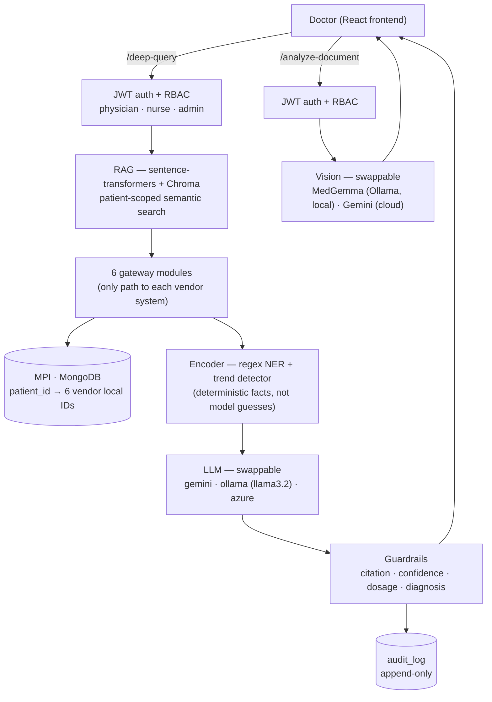

# Integrated Patient Data Retrieval System

A full-stack clinical tool that federates data from six isolated hospital department systems into a single unified view, with an AI clinical assistant (DocAssist) that reasons across all departments, flags abnormalities proactively, and supports voice interaction.

## Architecture Overview

Six departments each run their own separate vendor system — no shared database. A Master Patient Index (MPI) connects them. Every AI query is authenticated, retrieved with patient-scoped RAG, run through a deterministic encoder, sent to a swappable LLM backend, checked by guardrails, and logged to an append-only audit trail. This is the current (V4) state — see [Version History](#version-history) below for how it got here.



```
┌──────────────────────────────────────────────────────┐
│  Labs        │ SQLite       │ Sunquest simulation     │
│  MRI         │ JSON files   │ RIS simulation          │
│  X-Ray       │ dbm          │ PACS key-value          │
│  CT Scan     │ shelve       │ Object store simulation │
│  ECG         │ CSV          │ MUSE flat-file          │
│  Treatment   │ JSON         │ Epic (FHIR) simulation  │
└──────────────────────────────────────────────────────┘
```

Each department is a separate "vendor system" — only its gateway module knows how to talk to it. The backend never queries vendor systems directly.

## Stack

| Layer | Technology |
|---|---|
| Backend | FastAPI + Motor (async MongoDB) |
| Frontend | React (CRA/craco) + Tailwind + shadcn/ui + Recharts |
| Central DB | MongoDB 7.0 (MPI + patient index + audit log) |
| Dept systems | SQLite, JSON files, dbm, shelve, CSV, JSON (one per dept) |
| Auth | JWT (`python-jose` + `passlib`), 3 roles: physician / nurse / admin |
| Retrieval | RAG — `sentence-transformers` (local embeddings) + Chroma (local vector DB), patient-scoped |
| Text LLM | Swappable via `LLM_BACKEND` — Gemini, Ollama (`llama3.2`), or Azure OpenAI |
| Vision LLM | MedGemma via Ollama (local, images) or Gemini vision (cloud, images + PDFs) |
| Voice output | gTTS (server-side MP3, no browser TTS dependency) |

## Features

- Staff login (JWT-authenticated, role-based)
- Patient search by ID or name (500 realistic oncology patients)
- Department-wise medical records across all 6 systems, sorted chronologically
- Department-wide record browsing
- Per-patient analytics dashboard
- **DocAssist** — AI clinical assistant:
  - Answers natural-language questions across all 6 departments
  - RAG-based semantic retrieval (catches synonyms keyword routing missed, e.g. "blood cell count" → WBC)
  - Proactive abnormality flagging on patient load (silent unless findings exist)
  - Trend callouts on consecutive results (e.g. CEA 12.5 → 5.2 ng/mL), computed deterministically and fetched via tool-calling
  - "What changed?" quick action comparing current vs previous records
  - Collapsible evidence cards (shows exactly which records the AI used)
  - Conversation history (last 6 turns sent with each query)
  - Voice output via gTTS
  - Format override — "give me a paragraph" actually works
  - Disclaimer on every response
  - Image/PDF analysis via local (MedGemma) or cloud (Gemini) vision model
  - Guardrails on every response: citation check, confidence gate, drug-dosage flag, diagnosis-language flag
  - Every AI query logged to an append-only audit trail (HIPAA §164.312(b))

## Local Setup

### 1. MongoDB

```bash
brew services start mongodb-community
```

Or via Docker:
```bash
docker compose up -d mongo
```

### 2. Backend

```bash
cd backend
python3 -m venv venv && source venv/bin/activate
pip install -r requirements.txt
cp .env.example .env   # fill in GEMINI_API_KEY, SECRET_KEY — free key: https://aistudio.google.com/apikey
uvicorn server:app --reload
```

By default `LLM_BACKEND=gemini`. To run fully on-prem (no PHI leaves the machine), set `LLM_BACKEND=ollama` and run `ollama serve` locally — see [`backend/README.md`](./backend/README.md) for the full local-model setup including MedGemma vision.

### 3. Seed data (first run only)

```bash
# Reset MPI + all 6 vendor systems and seed 500 patients
curl -X POST "http://localhost:8000/api/init-data?reset=true"
```

> Seeding takes ~30–60 seconds for 500 patients across 6 vendor stores.
> Run once. Do not run again unless you want a fresh dataset.

### 4. Frontend

```bash
cd frontend
npm install
npm start
```

Open `http://localhost:3000`. Default login: `doctor` / `doctor123`

## Branch Structure

```
main                                      ← stable, production-ready
  └── feature/department-integration-v2   ← federated 6-dept architecture (V2)
        └── feature/ai-capabilities-v2    ← DocAssist AI improvements (V2)
              └── feature/v3-security-ai-pipeline  ← auth, audit, guardrails, local model (V3)
                    └── feature/v4-ai-capabilities ← RAG, MedGemma vision (V4, in progress)
```

## What's NOT Committed (intentionally)

Vendor data stores and vector index are generated locally and gitignored:

```
backend/data/sunquest.db       ← Labs (SQLite)
backend/data/mri_store/        ← MRI (JSON files)
backend/data/xray_store*       ← X-Ray (dbm)
backend/data/ct_store*         ← CT Scan (shelve)
backend/data/ecg_store.csv     ← ECG (CSV)
backend/data/treatment_store.json ← Treatment (JSON)
backend/data/chroma_store/     ← RAG vector index (Chroma)
backend/.env                   ← Gemini API key, JWT secret, HuggingFace token
```

Run `init-data` to regenerate the vendor stores + RAG index on any fresh clone.

## Version History

| Version | What it added | Details |
|---|---|---|
| V1 → V2 | Federated MPI + 6-department gateway architecture, DocAssist on Gemini | [`V2_PROGRESS.md`](./V2_PROGRESS.md) |
| V3 | JWT auth + RBAC, audit log, swappable LLM backend, encoder + guardrails, tool-calling, rate limiting | [`V3_PROGRESS.md`](./V3_PROGRESS.md) |
| V4 (in progress) | RAG over the 6 federated databases, MedGemma local vision model | [`V4_PROGRESS.md`](./V4_PROGRESS.md) |

For architecture decisions, security findings, and real-world implementation research behind all of the above, see [`project_knowledge.md`](./project_knowledge.md).
