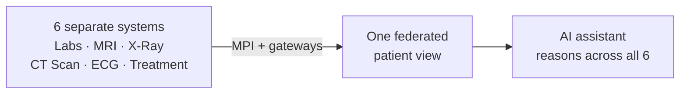
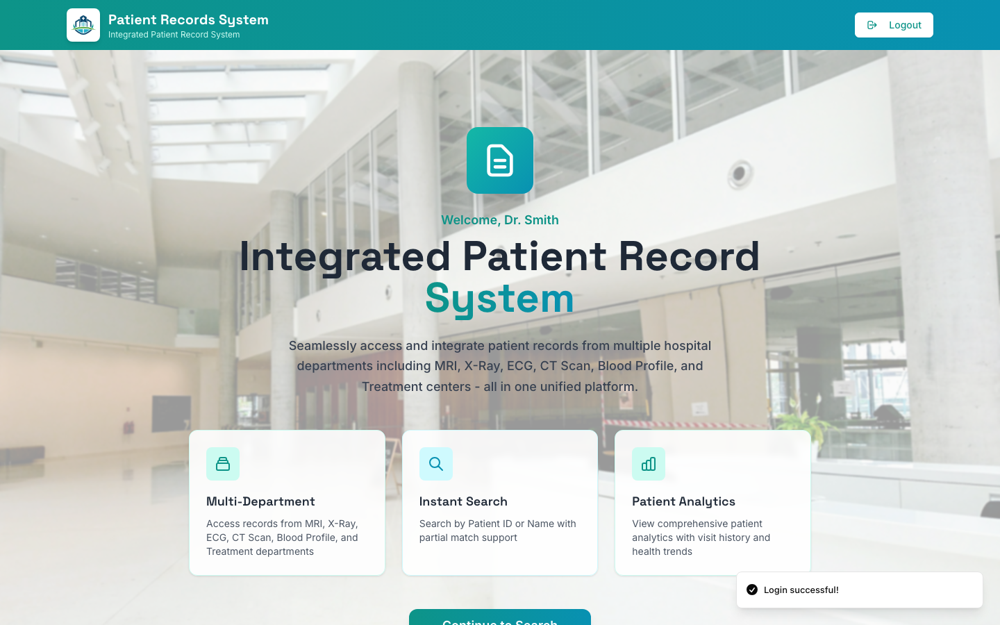
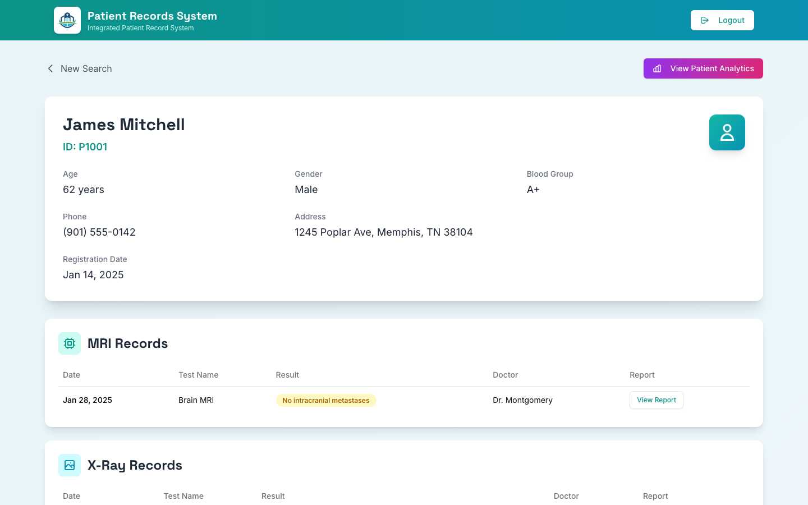
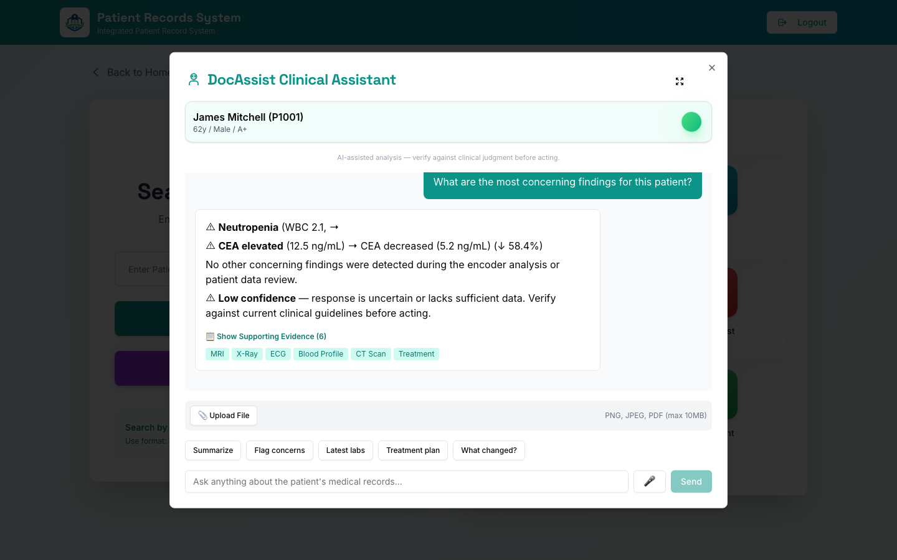
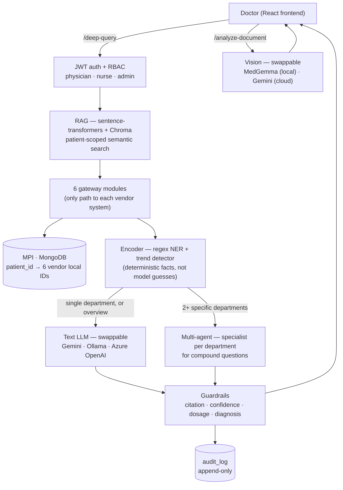

# Integrated Patient Data System

**Six hospital department systems that were never built to talk to each other, federated into one clinical view — with an AI assistant that reasons across all of them, safely.**


---

## Why this exists

At most hospitals, six departments — labs, imaging, ECG, treatment — each run their own vendor software, on their own storage technology, with no shared database. A clinician who wants one patient's full picture has to log into six different systems and mentally stitch the timeline together. That's not a hypothetical inefficiency — it's the actual, physical starting point of this project.

This system solves that in two layers: a **federated data layer** that unifies all six departments behind one Master Patient Index, and an **AI layer** on top of it — a clinical assistant that answers natural-language questions grounded in real records, not guesses. The data layer came first, deliberately — an AI that reasons well over data that isn't actually unified yet is just a fast way to be confidently wrong.



---

## See it in action

<table>
<tr><td width="33%"></td>
<td width="33%"></td>
<td width="33%"></td></tr>
<tr><td align="center"><sub>Staff login</sub></td>
<td align="center"><sub>Unified patient record across all 6 departments</sub></td>
<td align="center"><sub>DocAssist answering a real clinical question, grounded in the patient's actual records</sub></td></tr>
</table>

---

## What it does

- Patient search by ID or name across 500 generated oncology patients
- Every department's records in one place, sorted chronologically, with per-patient analytics
- **DocAssist** — an AI clinical assistant that:
  - Answers natural-language questions grounded in a patient's actual records, not memory
  - Retrieves relevant records via semantic search (catches synonyms keyword matching would miss — "blood cell count" still finds WBC results)
  - Splits compound questions across department-specific specialists when one question spans multiple departments, instead of one model trying to reason over everything at once
  - Computes lab trends and flags arithmetically, not by asking a model to do the math
  - Reads uploaded images/PDFs via a local vision model, or a cloud one — your choice
  - Shows exactly which records it used for every answer (evidence cards, not a black box)
  - Logs every query to an append-only audit trail

---

## Architecture



Every department is a genuinely different storage technology on purpose — mirroring how real hospital vendors actually diverge, not a simplified version of the problem:

| Department | Storage | Real-world equivalent |
|---|---|---|
| Labs | SQLite | Oracle/MSSQL PathNet-style relational DB |
| MRI | JSON files | DICOM file store + metadata DB |
| X-Ray | dbm (key-value) | PACS key-value index |
| CT Scan | shelve (objects) | Object storage (S3-like) |
| ECG | CSV flat file | MUSE flat-file exports |
| Treatment | JSON | HL7 FHIR resources (Epic) |

Each department's gateway module is the *only* code that knows how to talk to it — the backend never queries a vendor system directly, and every gateway normalizes its vendor's own format into one shared record shape before anything else sees it.

---

## Where the AI actually enters — and how it evolved

The AI side didn't arrive all at once — each stage fixed a real limitation the previous one had:

| Stage | Added | Why |
|---|---|---|
| **V2** | Gemini API + keyword-routed Q&A | Get a working assistant answering real questions across departments |
| **V3** | Local model option (Ollama), JWT/RBAC, audit log, guardrails | Cloud-only meant PHI had nowhere to go but out — needed an on-prem path, plus the security layer any of this would actually need in production |
| **V4** | RAG (semantic retrieval), MedGemma (local vision), multi-agent orchestration | Keyword matching missed real questions phrased differently; images had no local option yet; compound questions got worse answers reasoned over as one giant blob |

| Modality | V2 | V3 | V4 |
|---|---|---|---|
| Text | Gemini (cloud) | + Ollama (local) | + semantic retrieval |
| Images | Gemini vision (cloud only) | same | + MedGemma (local) |
| PDFs | Gemini | same | still Gemini — local vision models here take image bytes only |

---

## Built the hard way — real bugs, found live and fixed

Every one of these actually happened during testing, not a hypothetical risk list:

- **RAG had no relevance floor.** A natural greeting variant slipped past the greeting detector, fell through to semantic search, and got real patient medication data injected into what should've been a one-line reply — because nearest-neighbor search always returns *something*, even when nothing is actually relevant. Fixed with a cosine-distance threshold that drops low-relevance matches entirely.
- **A multi-agent specialist started inventing lab values it was never given.** Splitting a compound question into per-department specialists meant one shared "computed facts" block was reaching every specialist — including ones with no lab data — and a small model treated another department's facts as its own. Fixed by scoping computed facts per department, not globally.
- **The same multi-agent synthesis step sometimes silently dropped a specialist's finding.** Rather than trust the model to include everything every time, the final answer now deterministically appends every specialist's verbatim finding — so nothing can be silently lost, regardless of what the summary line says.
- **Two different questions produced near-identical answers.** "What's concerning?" and "summarize everything" both fetched the same six departments with nothing telling the model these were different asks. Fixed additively — pointing the model at already-flagged findings — deliberately *not* by hiding records from it, since that would risk silently hiding a real finding outside whatever keyword list defines "abnormal."
- **A vision model returned 400 errors on every image.** The GGUF conversion had only exported MedGemma's text backbone, not the separate vision projector a multimodal model needs. Re-converted with the right flag, confirmed by having it correctly describe both a shape and embedded text in a test image.
- **Chroma rejected a bulk index build outright** — one upsert call tried to embed all 7,129 records at once, past its batch-size limit. Fixed by chunking into batches of 1,000.

The throughline across all of these: wherever a fact can be computed or retrieved deterministically, do that — don't ask a small model to get it right from memory. Full write-up of every bug, root cause, and fix lives in [`V4_PROGRESS.md`](./V4_PROGRESS.md).

---

## Security & compliance posture

- JWT authentication, 3 roles (physician / nurse / admin) gating every route
- Append-only audit log — every AI query recorded (who, what patient, what question) — HIPAA §164.312(b)
- Prompt-injection defense — patient data is wrapped in delimiters and the model is told to treat it as data, never instructions
- 4-layer guardrails (citation, confidence, dosage, diagnosis-language) — additive flags, never silent censoring
- Rate limiting, keyed per-clinician JWT, not per-IP
- RAG's patient filter is applied *inside* the vector query itself, never as a post-filter — verified by a dedicated test, not just documented as an intention

**The honest gap, stated plainly:** the default cloud path (consumer Gemini API) has no BAA available at all — real patient data should never go through it. The local (`Ollama`) and Azure OpenAI paths exist specifically because they have a real compliance story; Azure's BAA is close to automatic, Ollama keeps everything on-prem entirely.

---

## Tech stack

| Layer | Technology |
|---|---|
| Backend | FastAPI + Motor (async MongoDB) |
| Frontend | React (CRA/craco) + Tailwind + shadcn/ui + Recharts |
| Central DB | MongoDB 7.0 (MPI + patient index + audit log) |
| Retrieval | `sentence-transformers` (local embeddings) + Chroma (local vector DB) |
| Text LLM | Swappable — Gemini, Ollama (`llama3.2`), or Azure OpenAI |
| Vision LLM | MedGemma via Ollama (local) or Gemini vision (cloud) |
| Auth | JWT (`python-jose` + `passlib`) |
| Voice | gTTS (server-side, no flaky browser TTS) |

---

## Version history

| Version | What it added | Details |
|---|---|---|
| V1 → V2 | Federated MPI + 6-department gateway architecture, DocAssist on Gemini | [`V2_PROGRESS.md`](./V2_PROGRESS.md) |
| V3 | JWT/RBAC, audit log, swappable LLM backend, guardrails, tool-calling, rate limiting | [`V3_PROGRESS.md`](./V3_PROGRESS.md) |
| V4 | RAG, MedGemma vision, multi-agent orchestration | [`V4_PROGRESS.md`](./V4_PROGRESS.md) |

Full architecture decisions, security research, and real-world production-path research: [`project_knowledge.md`](./project_knowledge.md).

---

## What's actually left before this could touch real patients

Being direct about this rather than overselling it:

- **No real BAA executed anywhere** — this is designed around the requirement, not a substitute for actually signing one with a real hospital as counterparty
- **No real EHR integration** — every department here is simulated; a real deployment means FHIR REST APIs through SMART on FHIR, not local file reads
- **No production infrastructure** — real GPU inside a hospital's network, `vLLM` instead of Ollama for concurrent throughput, high availability — all researched, none built
- **No clinical validation** — 100 passing unit tests proves the code does what it's supposed to; it says nothing about whether real doctors trust it or where the regulatory line is
- **Multi-agent only handles the simple case** — one specialist per department for a compound question; genuinely multi-step clinical reasoning is still open

---

## Running it locally

### 1. MongoDB
```bash
brew services start mongodb-community
```

### 2. Backend
```bash
cd backend
python3 -m venv venv && source venv/bin/activate
pip install -r requirements.txt
cp .env.example .env   # fill in GEMINI_API_KEY, SECRET_KEY
uvicorn server:app --reload
```
Default backend is Gemini. For a fully on-prem run (no data leaves the machine), set `LLM_BACKEND=ollama` and run `ollama serve` — see [`backend/README.md`](./backend/README.md) for the full local-model setup, including MedGemma vision.

### 3. Seed data (first run only)
```bash
curl -X POST "http://localhost:8000/api/init-data?reset=true"
```

### 4. Frontend
```bash
cd frontend
npm install
npm start
```
Open `http://localhost:3000`. Demo login: `doctor` / `doctor123`.

---

## Deeper documentation

- [`backend/README.md`](./backend/README.md) — backend architecture, gateway pattern, request flow
- [`frontend/README.md`](./frontend/README.md) — frontend routing and component structure
- [`project_knowledge.md`](./project_knowledge.md) — architecture decisions, security findings, production research
- [`V2_PROGRESS.md`](./V2_PROGRESS.md) · [`V3_PROGRESS.md`](./V3_PROGRESS.md) · [`V4_PROGRESS.md`](./V4_PROGRESS.md) — the real build log, decision by decision, bug by bug
