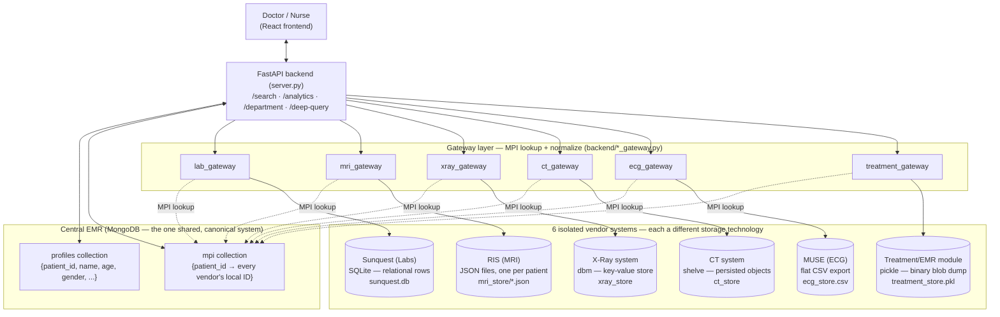
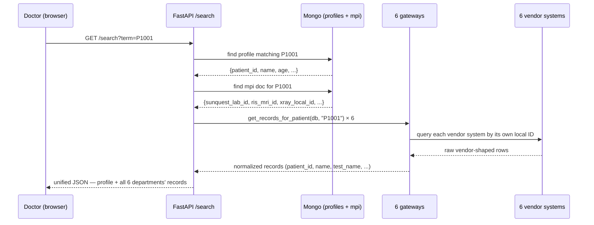
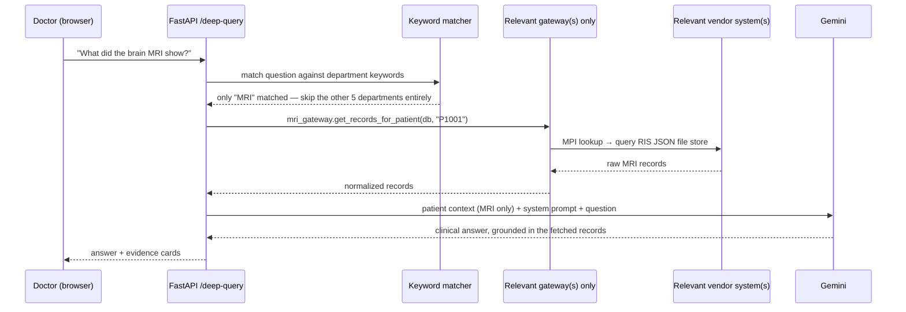

# V2 Progress Log — Federated Department Integration

> This file tracks *this specific initiative* step by step, as it happens.
> Different from the other two docs on purpose:
> - `plan.md` = the overall project roadmap (phases, checkboxes, what's done)
> - `RULES.md` = standing conventions to check before writing any code
> - `V2_PROGRESS.md` (this file) = a running log of *this* architecture change: what we decided, why, what got built, what broke, what got verified. Read this to understand how we got here, not what to do next.

Branch: `feature/department-integration-v2`

---

## Why this exists

The current system (main branch) is one shared MongoDB with 6 collections, all keyed
by the same `patient_id`. That's not how real hospitals work — each department
(EMR, radiology PACS, ECG/MUSE, lab/Sunquest) runs on a different vendor's system,
with its own local patient ID, and departments never query each other's databases
directly. They integrate through a translation layer.

V2's goal: make our architecture actually resemble that, starting with one
department as a pilot before touching the rest.

---

## Architecture overview

**Status: all 6 departments isolated.** Every department is its own simulated
vendor system, on its own storage technology, reachable only through a
Master Patient Index (MPI) + a gateway module — never a direct query.

**No vendor system talks to another, and none of them know the hospital's
canonical `patient_id`** — that's the whole point. Each only knows its own
local ID (`SQ-90000`, `RIS-100000`, `XR-200000`, `CT-300000`, `ECG-400000`,
`TX-500000` for the same patient, James Mitchell / P1001). Only the gateway
layer, via the MPI, knows how to translate between them.

### What each database actually looks like (sample: patient P1001, James Mitchell)

| System | Tech | Local ID | Sample row/record |
|---|---|---|---|
| Central EMR — `profiles` | Mongo | `P1001` | `{name: "James Mitchell", age: 62, gender: "Male", blood_group: "A+", ...}` |
| Central EMR — `mpi` | Mongo | `P1001` | `{patient_id: "P1001", sunquest_lab_id: "SQ-90000", ris_mri_id: "RIS-100000", xray_local_id: "XR-200000", ct_local_id: "CT-300000", ecg_local_id: "ECG-400000", treatment_local_id: "TX-500000"}` |
| Sunquest (Labs) | SQLite table | `SQ-90000` | `{sunquest_id: "SQ-90000", patient_name: "James Mitchell", test_name: "Complete Blood Count", result: "Neutropenia — WBC 2.1", ...}` |
| RIS (MRI) | JSON file `RIS-100000.json` | `RIS-100000` | `[{name: "James Mitchell", test_name: "Brain MRI", result: "No intracranial metastases", ...}]` |
| X-Ray system | dbm key → value | `XR-200000` | key `"XR-200000"` → JSON string of `[{test_name: "Chest X-Ray", result: "Suspicious mass...", ...}]` |
| CT system | shelve key → value | `CT-300000` | key `"CT-300000"` → Python list object `[{test_name: "Chest CT Scan", ...}, ...]` |
| MUSE (ECG) | CSV row | `ECG-400000` | `ECG-400000, James Mitchell, Resting ECG, 2025-01-15, Normal Sinus Rhythm, Dr. ...` |
| Treatment/EMR | pickle dict entry | `TX-500000` | `{"TX-500000": [{treatment_name: "Chemotherapy — Cisplatin/Pemetrexed Cycle 1", medicines: "...", ...}, ...]}` |

Notice none of the 6 vendor rows mention `P1001` anywhere — only their own
local ID. The mapping only exists in the central `mpi` collection.

### Flow 1 — Doctor searches a patient ID or name

The doctor never sees any of this — the response looks exactly like it did
before this rework, one JSON object with all departments. The difference is
entirely under the hood: 6 separate lookups through 6 separate technologies,
stitched together transparently.

### Flow 2 — DocAssist AI answers a question

"Smart context" (built in Phase 3) already skipped irrelevant departments to
save tokens — now it also means fewer vendor systems get touched per
question, which matters more now that each one is a real separate query.

---

## Step 1 — Scope decision (2026-07-20)

Discussed and decided:
- **Pilot on labs (blood_profile) only**, not all 6 departments at once — lower risk,
  proves the pattern before a bigger rewrite.
- **SQLite, not a second MongoDB database**, for the lab vendor ("Sunquest").
  Real lab vendors are relational systems, not document stores — using Mongo again
  would just be "Mongo talking to Mongo" and wouldn't force real cross-paradigm
  integration work. SQLite is Python stdlib — zero new dependencies.
- **Explicitly out of scope for this pilot**: no HL7/FHIR message simulation, no
  fuzzy/probabilistic patient matching (MPI is exact 1:1 for now), no repeating the
  pattern on the other 5 departments yet.
- Frontend stays untouched — the doctor-facing UI should never know or care that
  labs come from a different system underneath.

## Step 2 — Built the pieces (2026-07-20)

**`backend/data/lab_system.py`** — the simulated vendor's own database code. Plain
SQLite (`sunquest.db`), one table `lab_results`, keyed by `sunquest_id` (the
vendor's own local patient ID — it has no idea what our canonical `patient_id` is).
Functions: `reset_and_seed()`, `clear()`, `query_by_local_id()`, `query_all()`.

**`backend/lab_gateway.py`** — the integration layer. This is the part that mirrors
what a real hospital's integration engine does: look up the patient's vendor-local
ID via the **Master Patient Index (MPI)**, query the vendor system with that ID,
then normalize the result back into the same record shape every other department
already uses (`patient_id`, `name`, `test_name`, `test_date`, `result`, `doctor`,
`report_image`). Two functions: `get_records_for_patient()` (single patient) and
`get_all_records()` (department-wide view, reverse-maps every vendor-local ID back
to a canonical patient_id via the MPI).

**MPI** — a new Mongo collection, `mpi`, one document per patient:
`{"patient_id": "P1001", "sunquest_lab_id": "SQ-90000"}`. Generated at seed time in
`backend/data/seed.py`, alongside the existing patient/record generation.

**`server.py` wiring** — every place that used to do
`db.blood_profile_records.find(...)` directly (`/search`, `/analytics/{id}`,
`/department/{name}`, `/deep-query`) now calls `lab_gateway` instead. Seeding
(`populate_sample_data`) and clearing (`clear_data`) both updated to seed/wipe the
MPI collection and the SQLite file instead of writing labs into Mongo.

## Step 3 — Verified offline (2026-07-20)

Ran the seed pipeline directly (no server) to check the data shape before touching
the live app:
- 500 patients → 500 MPI mappings generated
- 2503 lab records correctly grouped by vendor-local ID and inserted into SQLite
- Spot-checked one patient (`P1001` / James Mitchell → `SQ-90000`) — 6 lab records
  correctly retrieved by local ID, right test names/dates/results attached
- `query_all()` returned all 2503 rows

## Step 4 — End-to-end verification (2026-07-23) — PASSED

Restarted backend, reset + reseeded (500 patients, 500 MPI mappings, 2503 lab
records into SQLite). All verified in the real browser/API, not just offline:
- [x] Patient search (`/api/search?term=P1001`) shows correct blood profile
      results, correctly attributed to the right patient
- [x] Department "Blood Profile" page lists all 2503 records across all patients,
      each with the correct canonical `patient_id` (reverse-mapped from the
      vendor's local ID via MPI) — confirms `get_all_records()` works
- [x] DocAssist AI (`/deep-query`) correctly answers a labs question for P1001 —
      "WBC 2.1, Neutropenia... CEA decreased (12.5 → 5.2 ng/mL)" — pulled entirely
      through the gateway, with evidence cards carrying the right patient_id/name
- [x] No errors in backend logs; `/api/init-data` returned 200 OK

**Labs pilot is proven end-to-end.** Every read path (search, department listing,
AI chat) now goes through MPI + SQLite instead of a direct Mongo query, and the
doctor-facing experience is unchanged.

---

## Step 5 — Decision: extend to all 6 departments, each fully isolated (2026-07-23)

Decided to go beyond a single pilot: **all 6 departments become fully isolated
systems**, each reached only through MPI + a gateway — no direct Mongo queries to
department data anywhere in the app. Explicitly considered and rejected the more
"realistic" consolidated model (one PACS for MRI/X-Ray/CT, Treatment folded into
the central EMR) — user wants maximum isolation per department regardless of how
real hospitals structure it.

**Storage varies by department** (different Python-stdlib persistence mechanism
each, no new dependencies) — deliberately not repeating the same pattern 6 times,
since real vendors aren't built the same way either:
- Labs → SQLite (relational) — done
- MRI → JSON files, one per patient (file-based, mimics PACS/RIS storing studies
  as discrete files) — done
- X-Ray, CT Scan, ECG, Treatment → still to build, each getting a different
  stdlib storage mechanism (candidates: dbm key-value store, csv flat file,
  shelve object store)

**Build order**: one department at a time — build, verify in the real browser/API,
commit — before starting the next. Central EMR (Mongo) keeps profiles + the MPI
collection regardless of how many departments get split out.

## Step 6 — MRI pilot (2026-07-23) — DONE

New: `backend/data/mri_system.py` (JSON-file vendor store, `mri_store/` directory,
one file per `ris_mri_id`), `backend/mri_gateway.py` (same MPI-lookup + normalize
shape as `lab_gateway.py`). MPI now carries both `sunquest_lab_id` and
`ris_mri_id` per patient. Same 4 call sites in `server.py` updated
(`/search`, `/analytics`, `/department`, `/deep-query`), plus seeding/clearing.

Verified end-to-end with 500 patients / 547 MRI records:
- [x] `/search?term=P1001` → correct MRI record (Brain MRI, 2025-01-29)
- [x] `/department/mri` → all 547 records, 0 orphaned (every vendor-local ID
      correctly reverse-mapped to a canonical patient_id)
- [x] `/deep-query` ("what did the brain MRI show?") → correct answer + evidence,
      sourced entirely from the JSON file store via the gateway

## Step 7 — Remaining 4 departments: X-Ray, CT Scan, ECG, Treatment (2026-07-23) — DONE

Built all 4 in one pass (user opted for speed over the strict one-at-a-time
build order from Step 5, but every department was still independently offline-
tested before touching the live server, and all 4 were verified end-to-end
together at the end).

**New MPI fields**: `xray_local_id`, `ct_local_id`, `ecg_local_id`,
`treatment_local_id` added alongside the existing two.

- **X-Ray** → `backend/data/xray_system.py`, `dbm.dumb` key-value store
  (`xray_store.dir/.dat/.bak`). Explicitly pinned to `dbm.dumb` rather than the
  generic `dbm` module — the generic one auto-picks a backend that varies by
  platform (gdbm/ndbm/dumb), which would make the on-disk filenames
  unpredictable.
- **CT Scan** → `backend/data/ct_system.py`, `shelve` persisted-object store
  (`ct_store`).
- **ECG** → `backend/data/ecg_system.py`, a single flat CSV file
  (`ecg_store.csv`) — mimics a legacy system that only exposes data via
  scheduled file exports rather than a live query API.
- **Treatment** → `backend/data/treatment_system.py`, a single `pickle` file
  (`treatment_store.pkl`) holding one binary-serialized dict — mimics a
  legacy system exposing a periodic binary data dump. Different record shape
  from the others (`treatment_name`/`treatment_date`/`medicines` instead of
  `test_name`/`test_date`/`report_image`) — `treatment_gateway.py` normalizes
  to that shape instead of reusing the standard one.

**Bug caught during offline testing, before touching the live server**:
`ct_system.py`'s existence check guessed `shelve`'s output file extension
(`.dir`/`.db`), but on this machine `shelve` actually writes a single
extensionless file (just `ct_store`). The check silently failed and
`query_all()`/`query_by_local_id()` always returned empty, even though seeding
had worked. Fixed by switching to `glob.glob(path + "*")` instead of guessing
extensions — this is also what made `clear()` robust across platforms. Caught
because every module gets an isolated offline correctness check (expected
count vs actual count) before being wired into the live app — this is why
that check exists.

`server.py` simplified further while wiring these in: `/department` and
`/deep-query`'s `fetch()` now use a `gateway_by_collection` dict instead of a
chain of `if` statements, since all 6 departments follow the exact same
call shape now.

Verified end-to-end with 500 patients, all matching pre-migration counts
exactly, zero orphaned records in any department:

| Department | Total records | Missing patient_id | Search (P1001) | AI chat |
|---|---|---|---|---|
| X-Ray | 568 | 0 | ✅ 3 records | not separately tested (same code path as MRI, already proven) |
| CT Scan | 947 | 0 | ✅ 3 records | not separately tested |
| ECG | 626 | 0 | ✅ 1 record | not separately tested |
| Treatment | 1938 | 0 | ✅ 5 records | ✅ tested — correct chemo/immunotherapy summary with medicines, correctly flagged a neutropenia dose-reduction event, evidence cards correct |

**All 6 departments are now fully isolated.** Nothing in `server.py` queries
department data directly from Mongo anymore — every read goes through a
gateway. Mongo's only remaining job is the central EMR: `profiles` + `mpi`.

## Open questions for later

- Whether to keep all 6 isolated long-term or consolidate later (e.g. real
  PACS-style consolidation of MRI/X-Ray/CT) is still an open call — current
  state deliberately favors maximum isolation per an explicit decision in
  Step 5, not because it's the most realistic hospital structure.
- No HL7/FHIR message simulation and no fuzzy/probabilistic patient matching
  in the MPI — both still explicitly out of scope, noted since Step 1.
- Per-patient PDF report generation (an actual formatted lab/imaging report
  document, vs. today's generic stock reference image) was discussed and
  intentionally deferred — different kind of work (document generation) from
  this architecture initiative.
