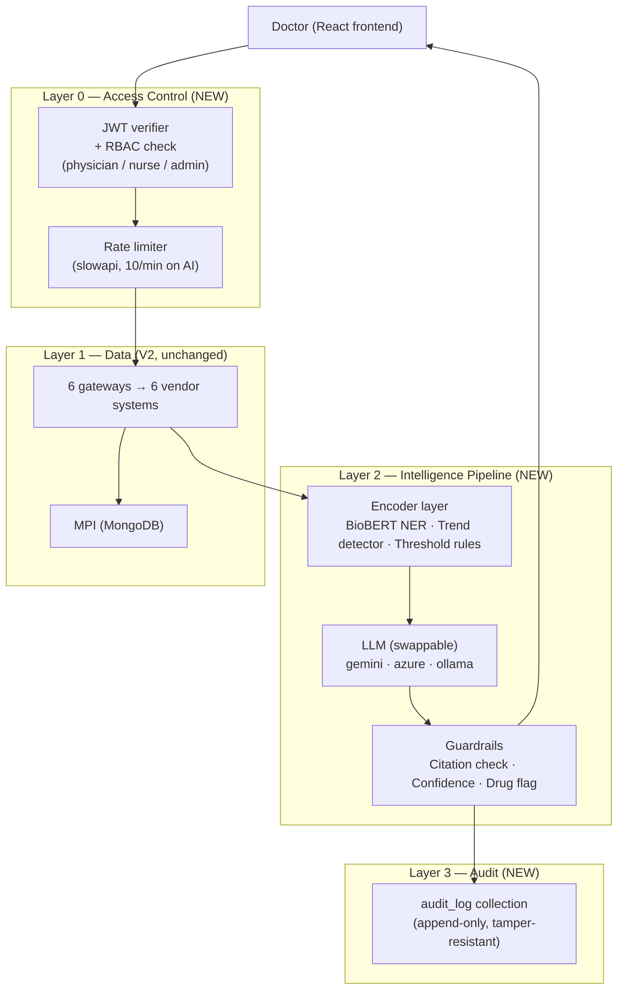

# V3 Progress Log — Security, AI Pipeline & Local Model

> Running log for the `feature/v3-security-ai-pipeline` branch.
> Same format as `V2_PROGRESS.md` — decisions, rationale, what got built, what broke, what got verified.
> Read this to understand the V3 architecture. For the overall roadmap see `plan.md`. For conventions see `RULES.md`.

Branch: `feature/v3-security-ai-pipeline`
Stacked on: `feature/ai-capabilities-v2` → `feature/department-integration-v2` → `main`

---

## Why This Exists

V2 proved the federated architecture and DocAssist AI layer. What V2 does NOT have:
- Any authentication — any process on the network can call `/deep-query` with any patient ID
- Any audit trail — HIPAA §164.312(b) mandates logging every ePHI access; we log nothing
- PHI staying on-network — every DocAssist query sends patient data to Google's Gemini API (no BAA)
- A swappable model backend — we're locked to one cloud provider
- Guardrails — the LLM can hallucinate, cite nothing, and the frontend shows it anyway

V3 fixes all of these. It's not a feature release — it's the security and compliance layer that would be required before any real hospital could run this system.

---

## Locked Design (decided 2026-07-26)

### What changes in V3

```
V2 pipeline:
  Doctor → /deep-query (no auth) → keyword router → gateways → Gemini → answer

V3 pipeline:
  Doctor → JWT auth check → /deep-query → query triage → gateways
        → [Encoder layer: trend signals + NER] → LLM (swappable backend)
        → [Guardrails: citation check + confidence] → answer + audit log entry
```

### Eight tasks, in build order

| # | Task | Risk | Time estimate |
|---|---|---|---|
| 1 | Pickle → JSON in `treatment_system.py` | Zero — isolated module | 30 min |
| 2 | JWT auth + RBAC (3 roles) | Medium — touches all routes | Half-day |
| 3 | Audit log (MongoDB append-only) | Low — one insert per query | 2 hours |
| 4 | `LLM_BACKEND` env var + routing | Low — additive | 2 hours |
| 5 | Ollama local model path | Medium — new HTTP client | Half-day |
| 6 | Encoder layer (trend detector + NER signals) | Medium — new module | 1–2 days |
| 7 | Guardrails layer (citation enforcer + confidence) | Medium — prompt + post-processing | 1 day |
| 8 | Rate limiting on AI endpoints | Zero — one decorator | 15 min |

---

## Architecture Overview



### Three LLM backends (swappable via `LLM_BACKEND` env var)

| Value | Endpoint | When to use |
|---|---|---|
| `gemini` | Google Gemini API | Demo — best quality, no BAA |
| `azure` | Azure OpenAI private tenant | Staging/production — HIPAA BAA available |
| `ollama` | `http://localhost:11434` | On-prem — PHI never leaves the machine |

### Three RBAC roles

| Role | Permissions |
|---|---|
| `PHYSICIAN` | Full AI access + all records |
| `NURSE` | Records read-only, no AI endpoints |
| `ADMIN` | User management, no patient data |

---

## Step 1 — Pickle → JSON (DONE — 2026-07-26)

`treatment_system.py`: replaced `import pickle` with `import json`, `DB_PATH`
changed from `.pkl` to `.json`, `reset_and_seed` uses `json.dump`, `_load`
uses `json.load`. `.gitignore` updated accordingly. `.env.example` untouched.

Zero impact on callers — `treatment_gateway.py` normalizes output regardless
of what the vendor system stores internally.

**Verified:** `test_treatment_store_is_json_not_pickle` — seed → JSON file
confirmed readable by `json.load` → round-trip query returns correct records. ✅

---

## Step 2 — JWT Auth + RBAC (DONE — 2026-07-26)

**Why JWT over sessions:** JWTs are stateless — no session table in the DB,
no server-side state to replicate. The token is self-contained: `{user_id, role, exp}`,
signed with a secret. Backend verifies signature on every request — O(1), no DB lookup.

**Three roles:**
- `PHYSICIAN` — the default clinical user. Full access to all patient data + AI endpoints.
- `NURSE` — read-only access to records. Cannot call `/deep-query` or `/analyze-document`.
- `ADMIN` — user management only. Cannot see patient data at all.

**Libraries:** `python-jose` (JWT signing/verification) + `passlib` (password hashing).
FastAPI has built-in OAuth2 support — `OAuth2PasswordBearer` wires the token to every route.

**Routes to protect:**
- All `/api/*` routes require a valid token
- `/api/deep-query` and `/api/analyze-document` require `role == PHYSICIAN`
- `/api/init-data` requires `role == ADMIN`

**What was built:**
- `backend/auth.py` — `create_token`, `get_current_user`, `require_physician`, `require_admin`, `USERS` dict
- `server.py` — `LoginResponse` gets `token` field; `/login` uses `USERS` from auth.py and returns JWT; all routes get `Depends`; `Depends(require_physician)` on `/deep-query` + `/analyze-document`; `Depends(require_admin)` on `/init-data` + `/clear-data`
- Frontend: `App.js` reads stored token on page load and sets axios default header + global 401 interceptor; `LoginPage.jsx` stores token and sets header on login; `Header.jsx` clears token on logout
- `.env.example` — `SECRET_KEY` and `LLM_BACKEND` documented

**Verified:** 5 JWT/RBAC tests — token creation, role encoding, tamper detection, USERS dict completeness. ✅

---

## Step 3 — Audit Log (DONE — 2026-07-26)

**HIPAA §164.312(b):** Every access to ePHI must be logged — who, what patient, when.

**Implementation:** MongoDB `audit_log` collection. One document per AI query:
```json
{
  "timestamp": "2026-07-26T14:32:01Z",
  "user_id": "dr_smith",
  "role": "PHYSICIAN",
  "patient_id": "P1001",
  "question_hash": "sha256_of_question",
  "departments_fetched": ["blood_profile_records", "mri_records"],
  "model_backend": "gemini",
  "model_version": "gemini-3-flash-preview",
  "response_length": 412
}
```

**No delete route exposed on audit_log.** Append-only enforced at the
application layer. In production this collection would be on a separate
MongoDB user with insert-only privileges.

**What was built:** One `await db.audit_log.insert_one(...)` call at the end of
`/deep-query`, after the LLM response is generated. Fields: `timestamp, user_id,
role, patient_id, question_hash (16-char sha256 prefix), departments_fetched,
model_backend, model_version, response_length`. Requires `current_user` from
`require_physician` — so auth and audit are coupled: no auth = no audit entry.

**Verified:** `test_audit_log_entry_shape` — validates all required fields and
types are present in the schema. ✅

---

## Step 4 — LLM_BACKEND Env Var (DONE — 2026-07-27)

Single env var in `.env`: `LLM_BACKEND=gemini` (default).

`server.py` reads `LLM_BACKEND` at startup and routes `generate_response()`
to one of three thin adapters — same prompt in, same structured response out.
No change to prompt logic, guardrails, or anything downstream. Switching model
= changing one line in `.env`.

`.env.example` updated with all three options and setup notes for each.

**What was built:**
- `LLM_BACKEND = os.environ.get("LLM_BACKEND", "gemini")` at module level
- `generate_response(prompt, system_message)` dispatches to `_gemini_generate`,
  `_ollama_generate`, or `_azure_generate` based on env var
- All three adapters share the same function signature; callers see no difference
- `/deep-query` now calls `generate_response()` instead of Gemini directly
- Auth import moved to top of `server.py` (was below `/tts` route — caused
  `NameError: get_current_user is not defined` at startup)

**Verified:** `test_gemini_backend_called_by_default`, `test_ollama_backend_called_when_set`,
`test_azure_backend_called_when_set` — each backend called exactly once with correct args. ✅

---

## Step 5 — Ollama Local Path (DONE — 2026-07-27)

**Requires (user-side, one time):**
```bash
brew install ollama
ollama pull llama3.2        # 2GB — fast, capable
# or: ollama pull meditron3  # if available — medical fine-tuned
```

**Backend:** `_ollama_generate()` — HTTP POST to `http://localhost:11434/api/chat`
with OpenAI-compatible message schema (`[{role:system,...},{role:user,...}]`).
Ollama's API matches OpenAI format exactly; the adapter is ~15 lines including
error handling.

**Why this matters for compliance demo:** Set `LLM_BACKEND=ollama` and PHI never
leaves the machine. No BAA needed. This is the "on-prem HIPAA story" for a demo
audience.

**Error handling:** `httpx.ConnectError` → `HTTPException(503)` with message
`"Ollama is not running. Start it with: ollama serve"` — actionable for the user.

**Verified:** `test_ollama_sends_correct_payload` — confirms URL, model, stream=False,
system+user message roles. `test_ollama_connect_error_gives_clear_message` — confirms
503 + guidance text when Ollama is unreachable. ✅

---

## Step 6 — Encoder Layer (DONE — 2026-07-27)

Two sub-components in `backend/encoder.py`:

**Trend detector** (pure Python, no ML):
- Groups lab records by `test_name`, sorts by `test_date`, computes direction + % change
- Flags: `CRITICAL` (≥50% change) | `HIGH` (≥20%) | `WATCH` (≥5%) | `STABLE`
- Output sorted by severity (most extreme changes first in the prompt block)
- Skips tests with only one reading (need ≥2 for a trend)

**NER signal extractor** (regex, no ML dependency):
- Scans `result`, `notes`, `medication`, `diagnosis` fields across all records
- Matches against curated lists: 31 oncology drugs, 20 diagnoses
- Case-insensitive, word-boundary matched — no false positives on substrings

**Prompt injection:** `format_encoder_block()` renders both as a structured block
injected between conversation history and raw records:
```
=== ENCODER ANALYSIS (Python-computed — cite these as facts) ===
LAB TRENDS:
  [CRITICAL] WBC: 45000 /µL → 3200 /µL (↓ 92.9%) [2026-01 → 2026-03]
DETECTED MEDICATIONS: cisplatin, pemetrexed
DETECTED CONDITIONS: neutropenia
=== END ENCODER ===
```

**Why this matters:** LLMs hallucinate numbers. A trend computed by Python is
provably correct. The LLM citing encoder output is safer than the LLM deriving
it independently from raw text.

**Verified:** 11/11 tests — falling/rising/stable trends, CRITICAL flag, date-sort
correctness, drug/diagnosis NER, case-insensitivity, empty-record handling, block format. ✅

---

## Step 7 — Guardrails Layer (PENDING)

Three checks applied to every LLM response before it reaches the frontend:

**Citation check:** Every factual claim about a lab value, diagnosis, or
treatment should trace to a retrieved record. System prompt enforces this.
Post-processing checks: if response makes a claim with no evidence card
counterpart, append `⚠ Unverified claim — check source records.`

**Confidence gate:** If response is shorter than N tokens or contains hedging
phrases ("I'm not sure", "it may be", "unclear from the records"), append:
`Verify against current clinical guidelines before acting.`

**Drug dosage flag:** Any response mentioning a drug dosage appends:
`Always confirm dosage against current formulary.`

These are additive — they don't remove content, they append structured warnings.
The frontend renders them distinctly (amber badge, not inline text).

---

## Step 8 — Rate Limiting (PENDING)

`slowapi` + `@limiter.limit("10/minute")` on `/deep-query` and `/analyze-document`.
Per-user limit based on JWT user_id, not IP (IP limits are trivially bypassed with VPN).
429 response includes `Retry-After` header.

---

## Test Plan

```bash
pip install pytest httpx pytest-asyncio
pytest backend/tests/ -v
```

Tests per feature:

| Feature | Test |
|---|---|
| JWT | No token → 401. Wrong role → 403. Valid physician token → 200. |
| RBAC | Nurse calls /deep-query → 403. |
| Audit log | Call /deep-query → audit_log collection has entry with correct user_id + patient_id. |
| LLM switch | `LLM_BACKEND=ollama` → Ollama endpoint called (mock). `LLM_BACKEND=gemini` → Gemini called. |
| Trend detector | Feed [{wbc:45000,date:T1},{wbc:3200,date:T2}] → {trend:"↓", pct:-93, flag:"CRITICAL"}. |
| Guardrails | Short/hedging LLM output → confidence warning appended. Drug mention → dosage flag appended. |
| Rate limit | 11th request in 1 minute → 429 with Retry-After header. |
| Pickle removed | `treatment_store` now a `.json` file, not `.pkl`. Round-trip test: seed → query → correct records. |
