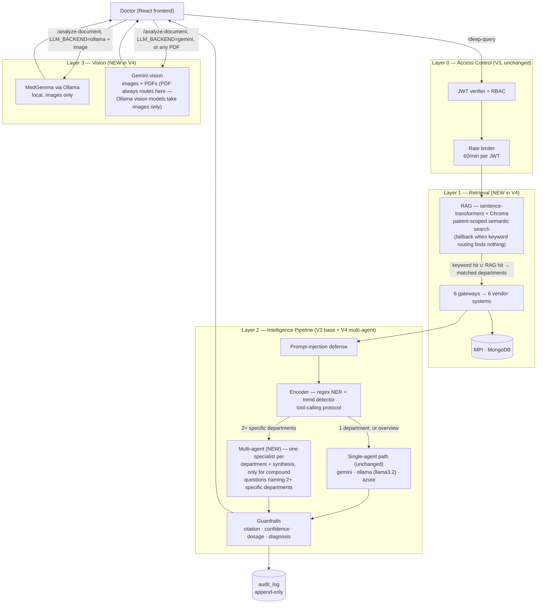

# V4 Progress Log — RAG, Multi-Agent, Multimodal & Production Path

> Running log for V4 work, same format as `V2_PROGRESS.md`/`V3_PROGRESS.md` —
> decisions, rationale, what got built, what broke, what got verified.
> For the overall roadmap see `plan.md`. For the research/decision background
> (real-world implementation survey, cloud BAA options, production pipeline
> mapping) see `project_knowledge.md` §11–18. For conventions see `RULES.md`.

Branch: `feature/v4-ai-capabilities`
Stacked on: `feature/v3-security-ai-pipeline` → `feature/ai-capabilities-v2` → `feature/department-integration-v2` → `main`

---

## Why This Exists

V3 shipped the security/compliance layer. Live testing against it (documented
in `V3_PROGRESS.md` Steps 9/9b/9c) surfaced real model-reliability issues and
confirmed the fixes. V4 adds new AI capability on top of a now-hardened base:

1. RAG over the 6 federated databases (real semantic search, not keyword matching)
2. MedGemma — local vision-capable model for image/PDF analysis
3. Multi-agent orchestration
4. The production deployment path (on-prem GPU serving, cloud BAA options)

---

## Locked Plan

| # | Task | Status |
|---|---|---|
| 1 | RAG over the 6 databases | **Built + live-verified** (Step 1) |
| 2 | MedGemma vision adapter | **Built + live-verified direct-to-Ollama** (Step 2); in-app end-to-end retest still pending |
| 3 | Multi-agent orchestration | **Built + live-verified** (Step 3) — hand-rolled, LangGraph deferred to a future version |
| 4 | Production deployment path | Research done (`project_knowledge.md` §14–16), no implementation — infra work, not code |

RAG target was redirected from "external medical literature" to "our own 6
databases" — see `project_knowledge.md` §12 for the reasoning. Literature RAG
is deprioritized, not dropped — a smaller follow-on later if wanted.

---

## Architecture Overview

Same layered shape as `V3_PROGRESS.md`'s diagram, with V4's three additions
made explicit: a retrieval layer in front of the gateways (RAG, replacing
keyword-only routing as the *primary* signal — keyword matches still win
when they hit; RAG is the fallback, see Step 1 below), a hand-rolled
multi-agent split inside the intelligence pipeline for compound questions
(Step 3), and a second model path for images/PDFs that V3 didn't have at all
(Step 2).



**Non-negotiable security requirement built into Layer 1, not retrofitted:**
the RAG `patient_id` filter is applied *during* the Chroma query, never as a
post-filter — verified by `test_retrieve_filters_by_patient_id`. Searching
across all 500 patients' embeddings and trusting similarity alone to keep
them separate would be a real cross-patient PHI leak, not a cosmetic bug.

---

## Step 1 — RAG over the 6 databases (BUILT — 2026-07-30, not yet live-verified)

### Why this fix, specifically

The keyword-based smart-context router (`server.py`, since V1) has a
documented weakness: "blood cell count" won't match the `wbc` keyword, so a
real question can silently fetch zero departments. RAG fixes this with
semantic search — meaning-based matching instead of literal keyword matching.

### Design

- **Embeddings: local** (`sentence-transformers`, model `all-MiniLM-L6-v2`) —
  not a cloud embedding API. Consistent with the on-prem/PHI-never-leaves-
  the-machine story; patient record text shouldn't hit an external API even
  "just for search."
- **Vector store: Chroma**, persisted locally to `backend/data/chroma_store/`
  (gitignored, same pattern as the other 5 vendor stores).
- **Security-critical requirement, built in from the start, not retrofitted:**
  every query filters by `patient_id` in the Chroma `where` clause at query
  time, never as a post-filter. Verified by test
  (`test_retrieve_filters_by_patient_id`) that the filter is actually passed
  through, not just documented as an intention.

### What was built

**`backend/rag.py`** (new):
- `record_to_text(record, department)` — normalizes both record shapes
  (standard test_name/test_date/result vs. treatment's treatment_name/
  treatment_date/medicines) into one consistent embeddable sentence
- `build_record_id(patient_id, department, index)` — deterministic ID for
  Chroma upsert (records have no persistent ID of their own)
- `build_rag_index(records_by_department)` — embeds and upserts every record;
  called from `populate_sample_data()` in `server.py`, after all 6 vendor
  stores are seeded (gateways need data to exist before they can be fetched)
- `reset_index()` — drops and recreates the Chroma collection, called before
  a full reseed so a stale index from previous data doesn't linger
- `retrieve_relevant_records(question, patient_id, top_k=6)` — the query-time
  function; patient-scoped similarity search

**`server.py` wiring — `/deep-query`:**
- `is_greeting`, `keyword_matched`, `is_overview` computed first, unchanged
- **RAG runs only as a fallback**: `not is_greeting and not keyword_matched
  and not is_overview` — i.e., only when the keyword classifier found
  nothing. Never overrides a working keyword match; purely additive.
- Runs *before* the department fetch (not after) specifically so its
  department hits feed into `needs_dept()` — this means departments RAG
  identifies get their *full* record set fetched the normal way, so evidence
  cards work identically for both the keyword path and the RAG fallback path.
  (First implementation had RAG running after the fetch, which would have
  left evidence cards empty for RAG-only hits — caught and reordered before
  it shipped, not after.)
- RAG-retrieved snippets are also injected directly into `patient_context` as
  a `SEMANTICALLY RELEVANT RECORDS` block — gives the LLM the specific
  matched text, not just "here's the whole department."
- `matched_departments` (used for evidence cards) now merges keyword hits and
  RAG hits, deduplicated.

**`populate_sample_data()`** — after all 6 vendor stores are seeded, calls
`rag.reset_index()` then fetches `get_all_records()` from all 6 gateways and
calls `rag.build_rag_index()`. Logs the count of records indexed.

**New dependencies:** `sentence-transformers==3.3.1`, `chromadb==0.5.23` —
added to `requirements.txt`. **Not yet installed in the dev venv** — need
`pip install sentence-transformers chromadb` before `/init-data` will
actually build a working index (currently `rag.py`'s heavy imports are all
lazy/inside functions, so the app and test suite both run fine without the
packages installed — but the real embedding/indexing calls will fail until
they are).

### What's verified vs. not

**Verified (unit tests, 10/10 passing, `test_v4_rag.py`):**
- Record-to-text normalization for both record shapes
- Record ID determinism and uniqueness
- Patient-ID filtering is actually passed to the Chroma query (not just
  intended) — this is the one that matters most for the security requirement
- Empty-result handling
- Index-building counts records correctly across departments

**Live-verified 2026-07-30:**
1. ✅ Deps installed, `/init-data` ran to completion — `RAG index built: 7129
   records embedded`. Hit and fixed a real bug getting here (below).
2. ✅ "how's her white cell count" (deliberately avoiding "wbc"/"blood") —
   RAG retrieval fired (confirmed via `Batches: 100%|1/1` in logs), and the
   answer correctly stated "WBC is normal for both recent tests" — the core
   fix works.
3. ✅ Evidence cards populated on the RAG-triggered path, not just keyword-matched.
4. ⏳ Cross-patient isolation spot-check — not done yet, still worth doing.

**Bug found and fixed during first live run — Chroma batch size limit.**
`build_rag_index()` tried to upsert all 7129 records in one call; Chroma
rejected it (`Batch size of 7129 is greater than max batch size of 5461`).
Fixed by chunking upserts into batches of 1000 — see `test_build_rag_index_chunks_large_batches`.

**Second bug found and fixed — RAG had no relevance floor, which widened
scope-leakage risk beyond what existed before RAG.** Live test: *"how are you
doing today?"* (a natural greeting variant, 5 words) missed the greeting
detector's exact-phrase list and ≤2-word heuristic, fell through to the RAG
fallback, and got real patient data injected (cyclophosphamide, Paclitaxel,
CA 15-3) into what should have been a one-line reply.

Root cause, and why this is a *new* risk RAG introduced rather than a pre-
existing gap: before RAG existed, "the keyword classifier found nothing"
meant zero data got injected — safe by default even if the greeting detector
missed a phrasing. After RAG, "found nothing" triggers a semantic search, and
nearest-neighbor search **always returns its top-K closest vectors**, even
when none of them are actually relevant — it has no built-in "nothing
matches" case. Growing the greeting phrase list is whack-a-mole, not a fix.

**Fix:** `rag.py` — collection now created with `metadata={"hnsw:space":
"cosine"}` (must be set at creation time, so this needs a fresh `reset_index()`
+ reseed to take effect) and `retrieve_relevant_records()` now requests
`distances` and drops any result past `MAX_DISTANCE = 0.75` — a tuned
heuristic, not a formula-derived value, documented as such in `rag.py` with
guidance on which direction to adjust it if real questions start coming back
empty or off-topic messages still leak data.

Full test suite: 77/77 passing (75 + 2 new for the distance threshold).

---

## Step 2 — MedGemma vision adapter (code done, model setup in progress — 2026-07-30)

### Code side (done, tested)

**`server.py`:**
- `_ollama_generate_vision(image_bytes, prompt, system_message)` — sends
  base64-encoded image in Ollama's `images` field, same pattern as
  `_ollama_generate()` but with an image attached. Reads `OLLAMA_VISION_MODEL`
  from env (default `medgemma`) — separate from `OLLAMA_MODEL` since a doctor
  might want a fast small model for text chat but MedGemma specifically for
  image review.
- `_gemini_generate_vision(image_bytes, mime_type, prompt, system_message)` —
  extracted from the old inline `/analyze-document` logic, now reuses the
  existing `generate_content_with_retry()` helper instead of duplicating the
  503-retry logic.
- `generate_vision_response(...)` — the dispatcher, same shape as
  `generate_response()`. **One deliberate exception:** PDFs always route to
  Gemini regardless of `LLM_BACKEND` — Ollama vision models take image bytes
  only, and PDF-to-image conversion isn't built. This closes the gap where
  `/analyze-document` was previously hardcoded to Gemini no matter what
  `LLM_BACKEND` said — a real, live PHI-leak-via-images risk for anyone
  actually relying on `LLM_BACKEND=ollama` for the on-prem story.
- `/analyze-document` now calls `generate_vision_response()` instead of
  building the Gemini `Part`/retry call inline.

**New file — `backend/data/download_medgemma.py`** — one-time setup script
(same category as `resolve_images.py`), downloads `google/medgemma-4b-it`
from HuggingFace to a sibling directory outside the repo (`../../model-weights/`
relative to `backend/`) using the token in `.env`.

**Verified:** 5 new tests (`test_v4_vision.py`) — backend routing (Ollama vs
Gemini), the PDF-always-Gemini exception, Ollama vision payload shape,
connect-error handling. 82/82 total across all V3 + V4 work. ✅

### Environment setup — DONE (2026-07-30)

1. ✅ HuggingFace access granted, token saved to `.env`
2. ✅ `cmake` installed (`brew install cmake` — was missing, needed for `llama.cpp`'s build)
3. ✅ `llama.cpp` cloned to `~/Desktop/Projects/llama.cpp` (sibling to the repo,
   not nested inside it) and built with Metal support (`cmake -B build -DGGML_METAL=ON`)
4. ✅ `google/medgemma-4b-it` downloaded via `download_medgemma.py` to
   `~/Desktop/Projects/model-weights/medgemma-4b-it/` (8.0GB, two safetensors shards)
5. ✅ Converted to GGUF — installed the one missing dependency (`gguf`,
   `sentencepiece`; torch/transformers were already present from
   sentence-transformers) into the existing backend venv rather than a
   second environment, then ran `convert_hf_to_gguf.py --outtype f16` →
   `medgemma-4b-it-f16.gguf` (7.76GB)
6. ✅ Imported into Ollama: `ollama create medgemma -f Modelfile` — Ollama
   auto-detected the `gemma3-instruct` chat template from the GGUF metadata,
   no manual template needed. Confirmed via `ollama list`: `medgemma:latest`, 7.8GB.
7. ✅ Sanity-checked directly against Ollama's API (text-only) — model loads
   and responds coherently ("I am a large language model created by the
   Gemma team at Google DeepMind..."). First load took ~18s (expected, one-
   time weight load into memory), eval after that was fast.

### Bug found and fixed — image analysis failed with 400 on first live test

Live test (via the real app, `LLM_BACKEND=ollama`, `OLLAMA_VISION_MODEL=medgemma`)
uploaded a real image twice — both attempts failed with `"Sorry, I encountered
an error analyzing the document."`. `ollama serve` logs showed both requests
returning HTTP 400, the second one in 220ms — too fast to be the model
attempting and failing; that's the API layer rejecting the request before the
model ever ran.

**Root cause:** MedGemma is multimodal — a text backbone plus a separate
vision encoder (SigLIP/CLIP) that projects images into the same space the
language model understands. The original conversion (`convert_hf_to_gguf.py
--outtype f16`, no other flags) only exported the **text backbone**.
Multimodal models need a second, separate GGUF — the "mmproj" (multimodal
projector) file — carrying the vision encoder. That was never generated, so
what got imported into Ollama was functionally text-only, which is exactly
consistent with the evidence: text-only chat worked fine in step 7, but any
request with an image attached was rejected immediately.

**Fix:**
1. Re-ran the conversion with `--mmproj` (a flag the main script already
   supports, just wasn't used the first time) → produced
   `mmproj-medgemma-4b-it-f16.gguf` (851MB, CLIP-architecture vision encoder,
   419.82M params)
2. Rewrote the Modelfile with **two `FROM` lines** — one for the base model,
   one for the mmproj file — and re-ran `ollama create medgemma -f Modelfile`
3. Verified via `ollama show medgemma` — now correctly lists `vision` under
   Capabilities, with a registered CLIP projector. (Worth noting: there's an
   open Ollama GitHub issue, #9967, reporting this exact two-`FROM`-line
   approach silently failing to retain vision for Gemma3-family models — it
   did NOT reproduce here on Ollama 0.32.4, either already fixed upstream or
   narrower than our case. Confirmed empirically rather than assumed.)
4. **Confirmed working end-to-end** — generated a test image (black
   background, white circle, text "TEST CHEST XRAY" overlaid) and sent it
   directly to Ollama. MedGemma's response: *"a chest X-ray with a circular
   shape potentially representing the heart, and text 'TESTCHESTXRAY'
   overlaid on it"* — correctly read both the shape and the embedded text.
   Real vision inference, not a guess.

No backend restart was needed for this fix — Ollama serves whatever's
currently registered under the `medgemma` name, live.

**Still to do:** re-test through the actual app (not just direct-to-Ollama)
with a real medical-style image via `/analyze-document`, to confirm the full
request path — backend → `generate_vision_response()` → Ollama — works
end-to-end, not just Ollama in isolation.

---

## Step 3 — Multi-agent orchestration (BUILT + live-verified — 2026-07-31)

### Design decision, resolved

Hand-rolled (plain Python), not LangGraph/CrewAI — explicit instruction: use
plain Python now, revisit a framework in a future version. Consistent with
this project's whole philosophy (`project_knowledge.md` §12) — no new
dependency, and the orchestration is simple enough that a framework would
add indirection without adding capability.

### Why this fix, specifically

Every question, however compound, went through one LLM call with every
matched department's records dumped into one prompt. For a question like
"how's her WBC and what did the MRI show?" that means one model call
reasoning over two unrelated departments at once — exactly the shape of
question a small local model (`llama3.2`) handles least reliably.

### Design

One specialist LLM call per matched department (narrow context: only that
department's records + that department's own encoder facts) → one
synthesizer call that merges the specialist answers into the existing
chart-note style. Mirrors the "explicit roles + shared-state handoff"
pattern from real multi-agent clinical-AI literature (`project_knowledge.md`
§11) rather than inventing a bespoke taxonomy.

**Trigger, reusing an existing signal — no new detection logic:**
`should_use_multi_agent(keyword_matched, is_overview)` = `len(keyword_matched)
>= 2 and not is_overview`. Two or more *specific* departments named in one
question → compound, worth splitting. A single department, or an overview
question ("summarize everything," which already fetches all 6 and works fine
as one broad prompt) → stays on the existing single-call path unchanged.

### What was built

**`backend/multi_agent.py`** (new):
- `should_use_multi_agent(keyword_matched, is_overview) -> bool`
- `run_specialist(department, records_text, question, encoder_block, generate_fn) -> str`
- `run_multi_agent(question, matched_departments, records_text_by_dept, encoder_block_by_dept, generate_fn) -> (final_answer, specialist_answers)`
- `generate_fn` is passed in (the existing `generate_response`) rather than
  imported directly — provider-agnostic for free, and trivially mockable in
  tests, same pattern already used elsewhere in this codebase.

**`server.py` wiring — `/deep-query`:** after departments are fetched, if
`multi_agent.should_use_multi_agent(...)` and not a greeting, branch to the
multi-agent path instead of the single `generate_response()` call; the
tool-calling loop is skipped for this path (specialists already receive
their own pre-computed encoder facts directly, so there's nothing left for
`TOOL_CALL` to fetch). Guardrails and the audit log run on the result either
way, unchanged — `multi_agent_used: bool` added to the audit log entry so
which path handled a given query is observable after the fact.

**Verified:** 11 new tests (`test_v4_multi_agent.py`) — trigger logic,
specialist prompt scoping, specialist-call-count and per-department
isolation, synthesis completeness. 93/93 total across V3 + V4.

### Live-verified 2026-07-31

Asked *"how is his WBC and what did the brain MRI show?"* for patient P1001
(James Mitchell — 1 MRI record, 6 Blood Profile records) — both via direct
`curl` against `/deep-query` and through the actual DocAssist chat in the
browser. `multi_agent_used: true` confirmed in the audit log both times.

**Bug found and fixed — cross-contamination via a shared global encoder
block.** First working version passed one `encoder_block` (computed over
*every* fetched department) to every specialist. The MRI specialist — given
zero blood data — started inventing WBC readings ("3,000 cells/μL", "4,200
cells/mm³") because a blood-derived `DETECTED CONDITIONS: neutropenia` fact
was sitting in its prompt and `llama3.2` treated it as its own to report on.
**Fix:** each specialist now gets an `encoder_block` computed *only* from its
own department's records (`encoder_block_by_dept`, built per-department in
`server.py` via the existing `detect_trends`/`extract_ner_signals`) — never
the shared global block. Regression-tested (`test_each_specialist_only_sees_
its_own_encoder_block`).

**Second bug found and fixed — the synthesizer sometimes dropped a
specialist's finding entirely.** Same live question, run three times: one
run's synthesis paragraph said "brain imaging not available" despite the MRI
specialist correctly reporting "No intracranial metastases" right there in
its own answer — the synthesis call silently failed to include it. Same
failure mode already documented in `V3_PROGRESS.md` steps 9/9b/9c: small
local models don't reliably restate/merge structured input every time.

**Fix, following this project's established "remove the opportunity to
fail" pattern (`project_knowledge.md` §13) rather than re-prompting and
hoping:** the final answer is no longer *only* whatever the synthesizer
returns. `run_multi_agent` now deterministically appends a verbatim
"by department" breakdown built directly from `specialist_answers` after the
synthesis text, every time — so even if the LLM's leading summary is
imperfect, the correct per-department finding is always present somewhere in
the response, by construction, not by hoping the model gets it right.
Confirmed in the live UI test: the synthesis paragraph occasionally still
undersells one department, but the "By department" section below it has
never once dropped a finding across repeated live runs.

Tightened the specialist prompt too (explicitly: omit out-of-scope topics
entirely rather than commenting on their absence) — reduced but didn't fully
eliminate a `llama3.2` habit of noting "WBC not available in MRI records."
Harmless (true statement, no fabricated data) and not worth further chasing
on a 3B model — the two structural fixes above are what actually mattered.

---

## Step 4 — Concern-focused questions producing near-duplicate answers (found + fixed — 2026-07-31)

### Bug, found live

Two different questions for the same patient — *"what are the most
concerning findings?"* and *"summarize this patient's overall status"* —
came back with answers differing by exactly 1 character. Confirmed via the
audit log this was not a caching/wiring bug: two genuinely separate calls
were made (different `question_hash`, different `response_length`), so the
duplication was the model itself, not the pipeline.

**Root cause:** both questions are "overview"-style, so both fetched all 6
departments and dumped the same full record set into the prompt with no
signal that "what's concerning" and "summarize everything" are different
asks. Faced with a large, identical context and two conceptually adjacent
questions, `llama3.2` (3B) latched onto the same handful of salient facts
both times.

**Fix, deliberately not a filter:** the tempting fix — only feed the model
records flagged as abnormal when a question is concern-focused — was
rejected. That would *hide* data from an already-unreliable small model,
which is a new, worse failure mode (a real finding outside whatever keyword
list defines "abnormal" would silently never reach the model at all) and
directly violates this project's own rule that guardrails/encoder logic are
additive, never a filter on content.

Instead: `encoder.py` gained `is_concern_focused_question()` (keyword check:
concerning/concern/abnormal/critical/worrisome/red flag/urgent) and
`build_concern_instruction()`, which — only when that's true — adds one
explicit instruction line to the prompt telling the model to lead with
whatever the encoder already flagged CRITICAL/HIGH or listed under DETECTED
CONDITIONS, and to say so explicitly if nothing is flagged. Every record
still reaches the prompt unchanged; nothing is removed or hidden. Wired into
`server.py`'s prompt construction in `/deep-query`.

**Verified:** 7 new unit tests (`test_v4_concern_focus.py`), 100/100 total.
Live-retested the exact repro case — the two questions now produce genuinely
different, correctly-scoped answers (concern-focused leads with only the
flagged neutropenia + mass findings and explicitly states no other
abnormalities were found; the summary gives the full balanced picture across
all departments).

---

## Test Plan (running total across V3 + V4)

```bash
cd backend && ./venv/bin/python -m pytest tests/ -v
```
100/100 as of this doc.
