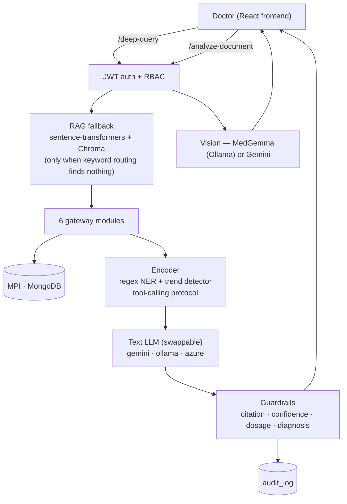

# Backend — Architecture Reference

FastAPI backend for the Integrated Patient Data Retrieval System.
Read this before touching any backend code.

## Directory Layout

```
backend/
├── server.py              # All API routes + prompt logic
├── lab_gateway.py         # Labs: MPI lookup → SQLite
├── mri_gateway.py         # MRI: MPI lookup → JSON files
├── xray_gateway.py        # X-Ray: MPI lookup → dbm
├── ct_gateway.py          # CT Scan: MPI lookup → shelve
├── ecg_gateway.py         # ECG: MPI lookup → CSV
├── treatment_gateway.py   # Treatment: MPI lookup → JSON (was pickle, V3 fix)
├── requirements.txt
└── data/
    ├── seed.py            # Generates all 6 vendor stores + MPI + patient profiles
    ├── lab_system.py      # SQLite vendor (sunquest.db)
    ├── mri_system.py      # JSON file vendor (mri_store/)
    ├── xray_system.py     # dbm vendor (xray_store)
    ├── ct_system.py       # shelve vendor (ct_store)
    ├── ecg_system.py      # CSV vendor (ecg_store.csv)
    ├── treatment_system.py # JSON vendor (treatment_store.json)
    ├── patients.json      # 12 curated patient profiles
    ├── scenarios/         # Per-patient medical timelines (one .json each)
    └── medical_images.json # Verified image URLs by test type
```

## Architecture Overview



## How a Request Flows

```
POST /api/deep-query  {patient_id: "P1001", question: "What did the MRI show?"}
        │
        ├── keyword classifier → matches "mri" → fetch only MRI dept
        │       (if no keyword matches: RAG fallback — semantic search over
        │        this patient's embedded records, see rag.py)
        │
        ├── mri_gateway.get_records_for_patient(db, "P1001")
        │       ├── MPI lookup: MongoDB mpi collection → ris_mri_id = "RIS-100000"
        │       └── mri_system.query_by_local_id("RIS-100000") → raw records
        │               └── opens mri_store/RIS-100000.json, returns list
        │
        ├── normalize records → shared shape: {patient_id, name, test_name, ...}
        │
        ├── encoder.py: regex NER + trend detector → deterministic facts,
        │       wrapped in delimiters (prompt-injection defense)
        │
        ├── build prompt: history_block + question + patient_context
        │
        ├── LLM_BACKEND-routed model (gemini / ollama / azure) → answer
        │
        ├── guardrails.py: citation / confidence / dosage / diagnosis checks
        │
        └── answer + evidence cards → frontend, logged to audit_log
```

Key rule: **`server.py` never queries a vendor system directly.** Every dept read
goes through the gateway. The gateway is the only code that knows what storage
technology that dept uses.

## Master Patient Index (MPI)

MongoDB collection: `mpi`. One document per patient:

```json
{
  "patient_id":        "P1001",
  "sunquest_lab_id":   "SQ-90000",
  "ris_mri_id":        "RIS-100000",
  "xray_local_id":     "XR-200000",
  "ct_local_id":       "CT-300000",
  "ecg_local_id":      "ECG-400000",
  "treatment_local_id":"TX-500000"
}
```

Vendor systems only know their own local ID. They have no idea `P1001` exists.
The MPI is the only thing that connects them.

## Gateway Contract

Every gateway exports two functions with the same signature:

```python
def get_records_for_patient(db, patient_id: str) -> list[dict]:
    # db = Motor async MongoDB client (for MPI lookup)
    # returns normalized records for one patient

def get_all_records(db) -> list[dict]:
    # returns all records across all patients (for /department endpoint)
    # must reverse-map vendor local IDs back to canonical patient_id via MPI
```

Every returned record must have at minimum:
`patient_id, name, test_name, test_date, result, doctor, report_image`

Treatment records also have: `treatment_name, treatment_date, medicines`
(no `test_name` / `report_image` — `treatment_gateway.py` normalizes to this shape)

## Vendor Storage Technologies

| Dept | File | Tech | Why |
|---|---|---|---|
| Labs | `sunquest.db` | SQLite | Relational — real lab vendors use SQL |
| MRI | `mri_store/*.json` | JSON files | File-based — mirrors PACS file stores |
| X-Ray | `xray_store` | dbm key-value | Key-value — fast indexed lookups |
| CT Scan | `ct_store` | shelve objects | Object store — native Python objects |
| ECG | `ecg_store.csv` | CSV flat file | File-drop export — legacy vendor pattern |
| Treatment | `treatment_store.json` | JSON | Was pickle (V3 security fix) |

None of these files are committed to git (all gitignored). Run `init-data` to regenerate.

## Seeding

```bash
# First time or full reset
curl -X POST "http://localhost:8000/api/init-data?reset=true"

# Without reset (only seeds if stores are empty)
curl -X POST "http://localhost:8000/api/init-data"
```

`seed.py` generates:
1. Patient profiles → MongoDB `profiles` collection
2. MPI mappings → MongoDB `mpi` collection
3. Lab records → SQLite `sunquest.db`
4. MRI records → JSON files in `mri_store/`
5. X-Ray records → dbm `xray_store`
6. CT records → shelve `ct_store`
7. ECG records → `ecg_store.csv`
8. Treatment records → `treatment_store.json`

Seed is deterministic (`random.seed(42)`) — same data every run.
500 patients: 12 curated oncology profiles + 488 generated extras.

## Smart Context Routing

`server.py` maps keyword hits to department collections:

```python
overview_keywords = ['summarize', 'summary', 'overview', 'status', 'records',
                     'details', 'history', 'everything', 'concerns', 'concerning',
                     'changed', 'change', 'compare', 'comparison', 'trend', 'progress']
```

Single-dept keywords: `blood`, `wbc`, `cbc` → labs only. `mri`, `brain scan` → MRI only. Etc.
Overview keywords → all 6 departments fetched.
Greetings / general questions → 0 departments fetched (LLM answers from parametric knowledge only).

**Important:** Classifier runs against the NEW question only, not conversation history.
History is sent as a separate `conversation_history` field so old mentions of
"WBC" from a prior turn don't silently narrow department fetching for a new question.

## Environment Variables

```bash
# backend/.env (never committed)
MONGO_URL=mongodb://localhost:27017
DB_NAME=integrated_patient_system
GEMINI_API_KEY=your_key_here
LLM_BACKEND=gemini            # gemini | azure | ollama  (V3)
SECRET_KEY=your_jwt_secret    # (V3)
OLLAMA_MODEL=llama3.2         # text model when LLM_BACKEND=ollama  (V3)
OLLAMA_VISION_MODEL=medgemma  # vision model for /analyze-document  (V4)
HUGGINGFACE_TOKEN=            # only for backend/data/download_medgemma.py, one-time setup  (V4)
```

## V3 Additions (done)

- JWT auth on all routes (`python-jose` + `passlib`)
- RBAC: `PHYSICIAN` / `NURSE` / `ADMIN`
- Audit log: `audit_log` MongoDB collection, append-only
- `LLM_BACKEND` switching: Gemini / Azure OpenAI / Ollama
- Encoder layer (`encoder.py`): regex-based NER (drug/diagnosis lists) + trend
  detector before the LLM call — deterministic, not model-generated
- Prompt-injection defense: patient data wrapped in delimiters, system prompt
  treats it as data-only
- Tool-calling protocol: model fetches exact computed values (e.g. a lab
  trend) via a `TOOL_CALL:` marker instead of restating them from memory
- Guardrails (`guardrails.py`): citation check + confidence gate + drug
  dosage flag + diagnosis-language flag
- Rate limiting: `slowapi`, per-user (keyed to JWT), 60/min on AI endpoints

See `V3_PROGRESS.md` for full design, build order, and the live-testing bugs
that shaped the final numbers above (rate limit and NER approach both changed
from the original plan during implementation).

## V4 Additions (RAG, MedGemma vision, multi-agent — all built + live-verified)

- RAG (`rag.py`): `sentence-transformers` (`all-MiniLM-L6-v2`, local) + Chroma
  (local vector DB), patient-scoped semantic search — runs as a fallback when
  the keyword classifier finds nothing, catching synonyms it would otherwise
  miss (e.g. "blood cell count" → WBC)
- MedGemma vision adapter (`_ollama_generate_vision` in `server.py`): local,
  on-prem image analysis via Ollama when `LLM_BACKEND=ollama`; PDFs still
  route to Gemini (Ollama vision models take image bytes only)
- Multi-agent orchestration (`multi_agent.py`): hand-rolled, not a framework —
  one specialist LLM call per department for compound questions naming 2+
  specific departments, then a synthesizer call; single-department and
  overview questions are unaffected and stay on the original one-call path

See `V4_PROGRESS.md` for full design and every live-testing bug found and
fixed along the way — RAG's Chroma batch-size limit and missing relevance
floor, the MedGemma GGUF/mmproj setup, and multi-agent's encoder-block
cross-contamination and synthesis-completeness bugs.

## Running Tests (V3 + V4)

```bash
cd backend
source venv/bin/activate
pip install pytest httpx pytest-asyncio
pytest tests/ -v
```
